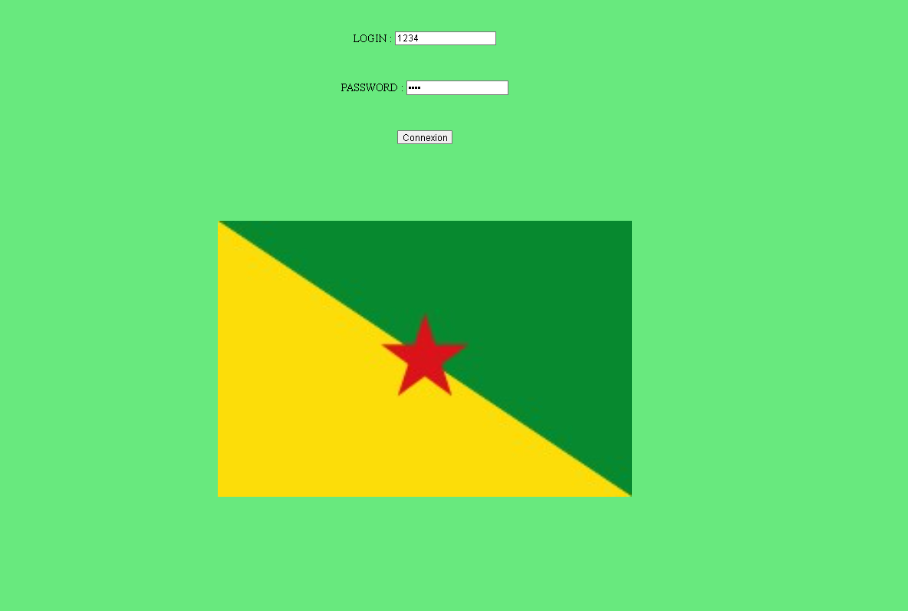
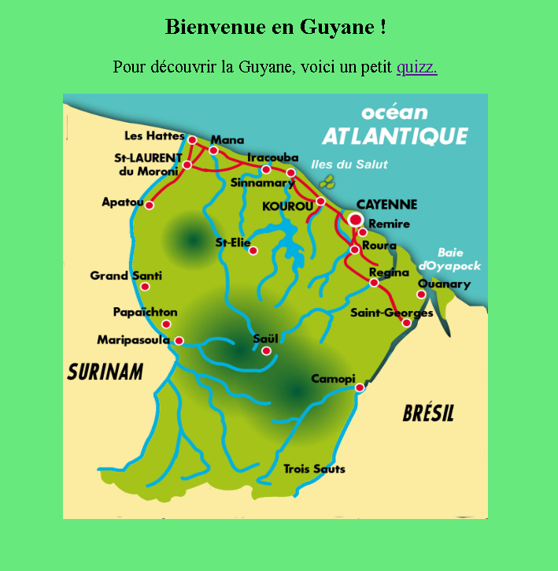
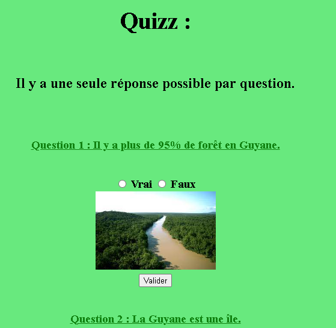

# Quiz sur la Guyane

J’ai créé un site web simple permettant aux utilisateurs de se connecter et de participer à un quiz interactif sur la Guyane.

## Sommaire
- [Aperçu](#aperçu)
- [Fonctionnalités](#fonctionnalités)
- [Utilisation](#utilisation)
- [Technologies Utilisées](#technologies-utilisées)
- [Licence](#licence)

## Aperçu

## Fonctionnalités

- **Connexion** : Accès au site via un identifiant et un mot de passe.
- **Quiz** : Quiz interactif permettant de tester ses connaissances sur la Guyane.

## Utilisation

Pour exécuter le projet, lancez le fichier `views.py` dans un environnement Python.\
Ensuite, ouvrez votre navigateur et accédez à l'URL suivante : [http://localhost:5000/](http://localhost:5000/).

L'identifiant par défaut est **1234** et le mot de passe **1234**. (Ils peuvent être modifiés dans le fichier Python).

## Technologies Utilisées

- **Back-end** : Python avec Flask pour la gestion de la logique du site.
- **Front-end** : HTML, CSS, JavaScript pour l’interface utilisateur et l’interactivité du quiz.

## Licence

Réaliser dans le cadre d'un projet scolaire en mai 2023.
